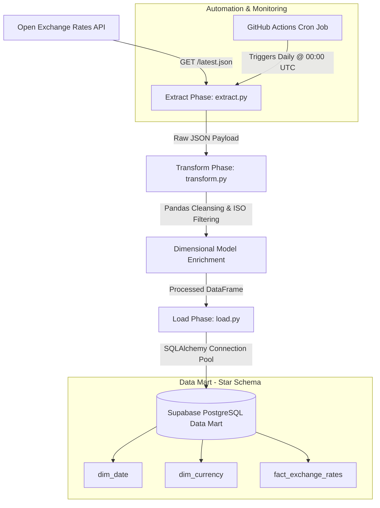
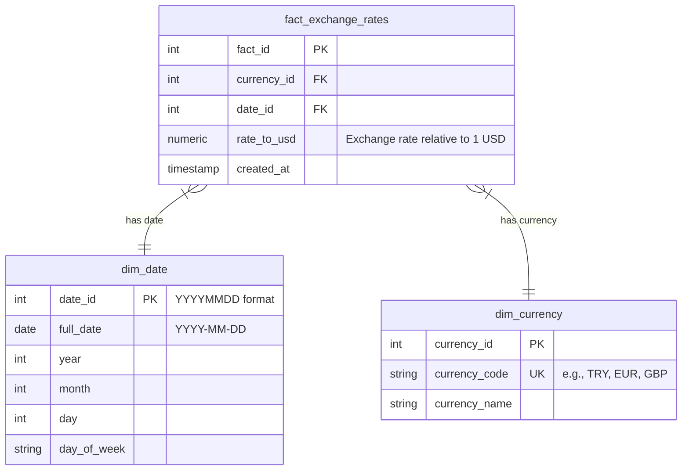
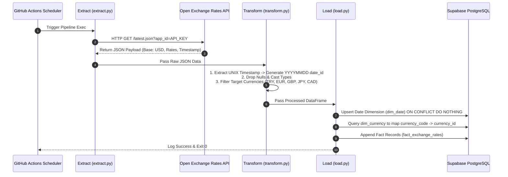

# 🚀 Automated Financial Batch ETL Pipeline & Data Mart

[](https://github.com/yonzbro/BATCHETLP-PEL-NE/actions)
[](https://www.python.org/)
[](https://supabase.com/)

An enterprise-grade, automated **Batch ETL (Extract, Transform, Load) Pipeline** designed to ingest daily global currency exchange rates, transform and enrich the financial data, and load it into a cloud-hosted **PostgreSQL Data Warehouse (Supabase)** structured in a dimensional **Star Schema**.

---

## 🏗️ Architecture & System Design

The pipeline runs automatically on a scheduled **daily cron job** via GitHub Actions or on-demand via workflow dispatch.



---

## ⭐️ Data Warehouse Star Schema

The data warehouse uses a dimensional **Star Schema** optimized for OLAP analytical queries, historical rate tracking, and BI dashboard reporting.



### Table Definitions

#### 1. `dim_date` (Date Dimension)
Stores calendar dimension attributes to enable fast date-range analytics and time-series aggregation without costly runtime date parsing.
- **`date_id`**: Integer primary key in `YYYYMMDD` format (e.g. `20260801`).
- **`full_date`**: ISO date representation (`2026-08-01`).
- **`year`, `month`, `day`, `day_of_week`**: Extracted attributes for time-slice indexing.

#### 2. `dim_currency` (Currency Dimension)
Lookup dimension for target ISO currency codes (`TRY`, `EUR`, `GBP`, `JPY`, `CAD`).
- **`currency_id`**: Auto-incrementing surrogate primary key.
- **`currency_code`**: Unique 3-letter ISO 4217 code.

#### 3. `fact_exchange_rates` (Fact Table)
Grain: **One row per currency rate per day**.
- **`rate_to_usd`**: High-precision decimal rate (`NUMERIC(18, 6)`).
- **`unique_currency_date`**: Composite unique constraint (`currency_id`, `date_id`) ensuring idempotent data ingestion.

---

## ⚡ ETL Pipeline Workflow



---

## 📁 Repository Structure

```
.
├── .github/
│   └── workflows/
│       └── etl_schedule.yml      # GitHub Actions CI/CD pipeline definition
├── scripts/
│   ├── __init__.py
│   ├── extract.py                # Ingests API data with error handling
│   ├── transform.py              # Data hygiene, type conversion & filtering
│   ├── load.py                   # Dimensional model database loader
│   └── main.py                   # Orchestrator entry point
├── sql/
│   └── schema.sql                # DDL scripts for Star Schema creation
├── .env                          # Local environment config (git-ignored)
├── .gitignore
├── requirements.txt              # Project dependencies
└── README.md                     # Documentation
```

---

## 🛠️ Local Setup & Execution Guide

### Prerequisites
- Python 3.10+
- PostgreSQL Database (Supabase recommended)
- Open Exchange Rates API Key

### 1. Clone & Install Dependencies
```bash
git clone https://github.com/yonzbro/BATCHETLP-PEL-NE.git
cd BATCHETLP-PEL-NE
python -m venv venv

# On Windows:
venv\Scripts\activate
# On Linux/macOS:
source venv/bin/activate

pip install -r requirements.txt
```

### 2. Configure Environment Variables
Create a `.env` file in the root directory:
```env
EXCHANGE_RATE_API_KEY=your_api_key_here

DB_HOST=your_db_host
DB_PORT=6543
DB_NAME=postgres
DB_USER=your_db_user
DB_PASS=your_db_password
DB_SSLMODE=require
```

### 3. Initialize Database Schema
Execute the DDL script in your PostgreSQL database:
```bash
psql -h <DB_HOST> -U <DB_USER> -d postgres -f sql/schema.sql
```

### 4. Execute Pipeline
```bash
python scripts/main.py
```

---

## ☁️ GitHub Actions Automated Deployment

To automate the daily pipeline execution:
1. Navigate to **Settings > Secrets and variables > Actions**.
2. Click **New repository secret**.
3. Set **Name** to `ENV_FILE` and paste the contents of your `.env` file into **Secret**.
4. The workflow will run automatically every day at **00:00 UTC** or can be manually triggered under the **Actions** tab.
